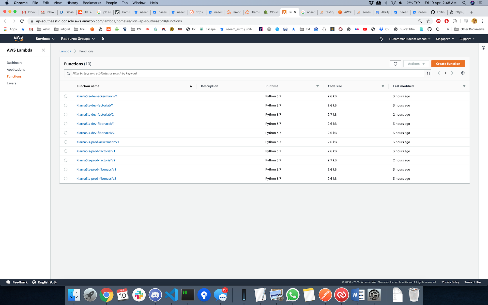

# Klarna Serverless #

Demonstration of Requirements understanding, proposing a solution and implementation by using the latest tools and techniques.

### What is this repository for? ###

* This app is built as assignment for Klarna.
* Adds `nosetests` for unit testing.
* CI/CD Demonstration
* AWS Resources Monitoring and maintenance of multiple versions
* Code quality measures using [SonarCloud.io](https://sonarcloud.io/dashboard?id=naeem__astro_klarna-serverless)
* Adds different libs/packages to enhance the application quality and performance.
* Version 1.0.0

### Problem Statement:
 

### Proposed Solution:
- It is proposed to use [Serverless](http://serverless.com/) to design a single service containing multiple [AWS lambda functions](https://aws.amazon.com/lambda/) to cover each feature.

### Deployment:
- The deployment will be done using [Bitbucket-Pipelines](https://bitbucket.org/product/features/pipelines)

### Development Cycle:
- Distributes the whole development into Issues
- Go through the [Bitbucket Issues Page](https://bitbucket.org/naeem__astro/klarna-serverless/issues)

### Deliverable Content ###
- Stage: _Dev_
  - v1
    - [Fibonacci](https://1qud313c6f.execute-api.ap-southeast-1.amazonaws.com/dev/api/v1/fibonacci?n=10)
    - [Factorial](https://1qud313c6f.execute-api.ap-southeast-1.amazonaws.com/dev/api/v1/factorial?n=10)
    - [Ackermann](https://1qud313c6f.execute-api.ap-southeast-1.amazonaws.com/dev/api/v1/ackermann?m=1&n=3)
  - v2
    - [Fibonacci](https://1qud313c6f.execute-api.ap-southeast-1.amazonaws.com/dev/api/v2/fibonacci?n=10)
    - [Factorial](https://1qud313c6f.execute-api.ap-southeast-1.amazonaws.com/dev/api/v2/factorial?n=10)

- Stage: _Prod_
  - v1
    - [Fibonacci](https://ag2k98qedk.execute-api.ap-southeast-1.amazonaws.com/prod/api/v1/fibonacci?n=5)
    - [Factorial](https://ag2k98qedk.execute-api.ap-southeast-1.amazonaws.com/prod/api/v1/factorial?n=5)
    - [Ackermann](https://ag2k98qedk.execute-api.ap-southeast-1.amazonaws.com/prod/api/v1/ackermann?m=1&n=1)
  - v2
    - [Fibonacci](https://ag2k98qedk.execute-api.ap-southeast-1.amazonaws.com/prod/api/v2/fibonacci?n=5)
    - [Factorial](https://ag2k98qedk.execute-api.ap-southeast-1.amazonaws.com/prod/api/v2/factorial?n=5)

## How do you get set up? ##

### How to set up ###
To set-up the project locally you need to clone this repo, from `master` or `develop` branch or some latest `TAG`

### Test App
- Activate Virtual Environment `venv/bin/activate` 
- Install dependencies `pip install -r requirements.txt`   
- Run `nosetests -sv --with-xunit --xunit-file=nosetests.xml --with-xcoverage --xcoverage-file=coverage.xml --cover-package=src --cover-branches` to see the unit test execution report

### Configuration ###

### Pre-reqs

- [Python 3.7](https://www.python.org/downloads/release/python-376/)
- [VS Code](https://code.visualstudio.com/)
- [Serverless](http://serverless.com/)
- [pip](https://pypi.org/project/pip/)
- [nosetests](https://nose.readthedocs.io/en/latest/)
- [Bitbicket](www.bitbucket.org)
- [Bitbicket-pipelines](https://bitbucket.org/product/features/pipelines)

## Requirements ##

- See [`requirements.txt`](/requirements.txt)

## Major Libraries and tools included: ##

- serverless
- venv
- sonar-scanner

### Auth ###
- No auth is used for this version, though we can do it using authorizer on API Gateway level
- Another possible way is to use [JWT](https://jwt.io/)

## Code Quality ##
- Access the code analysis report: [SonarCloud](https://sonarcloud.io/dashboard?id=naeem__astro_klarna-serverless)

## Distribution ##
- A git repository
- A postman collection: https://www.postman.com/collections/f05ea1a1669f862add44

## Monitoring ## 
- AWS Dashboard is created
- Several widgets are created to show the performance of API's and Lambdas

## Contribution guidelines ##

- Forks are always appreciated

## Screenshots ##

